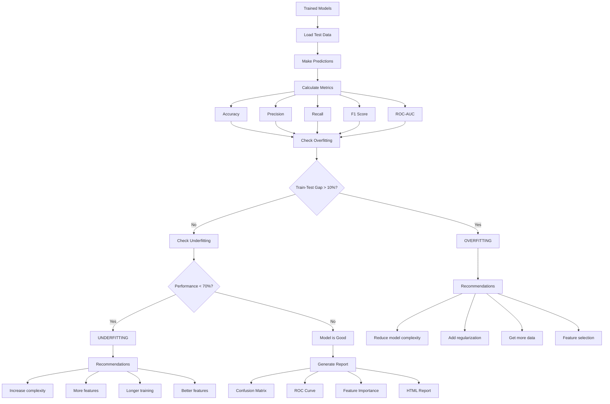

# MLOps Pipeline Workflow Diagrams

This document contains visual representations of the complete MLOps pipeline workflow.

## Table of Contents

1. [Complete Pipeline Flow](#complete-pipeline-flow)
2. [Data Pipeline](#data-pipeline)
3. [Model Training Flow](#model-training-flow)
4. [Deployment Architecture](#deployment-architecture)
5. [CI/CD Pipeline](#cicd-pipeline)
6. [Monitoring Flow](#monitoring-flow)

---

## Complete Pipeline Flow

---

## Data Pipeline

---

## Model Training Flow

---

## Deployment Architecture

---

## CI/CD Pipeline

---

## Monitoring Flow

---

## Drift Detection Flow

---

## Model Evaluation Flow

---

## Security Flow

---

## End-to-End Request Flow

---

## Resource Scaling Flow

---

## Notes

### Diagram Tools

These diagrams are written in Mermaid syntax and can be rendered using:

- GitHub (native support)
- Mermaid Live Editor: https://mermaid.live/
- VS Code extensions
- Documentation sites

### Color Legend

- **Green**: Success path
- **Red**: Error/failure path
- **Yellow**: Warning/alert
- **Blue**: Normal operation
- **Gray**: Decision point

### Updating Diagrams

When modifying the pipeline, update these diagrams to reflect:

1. New stages in CI/CD
2. Additional monitoring metrics
3. New security checks
4. Modified deployment strategy
5. Updated scaling policies

---

**Last Updated**: 2024
**Version**: 1.0.0
